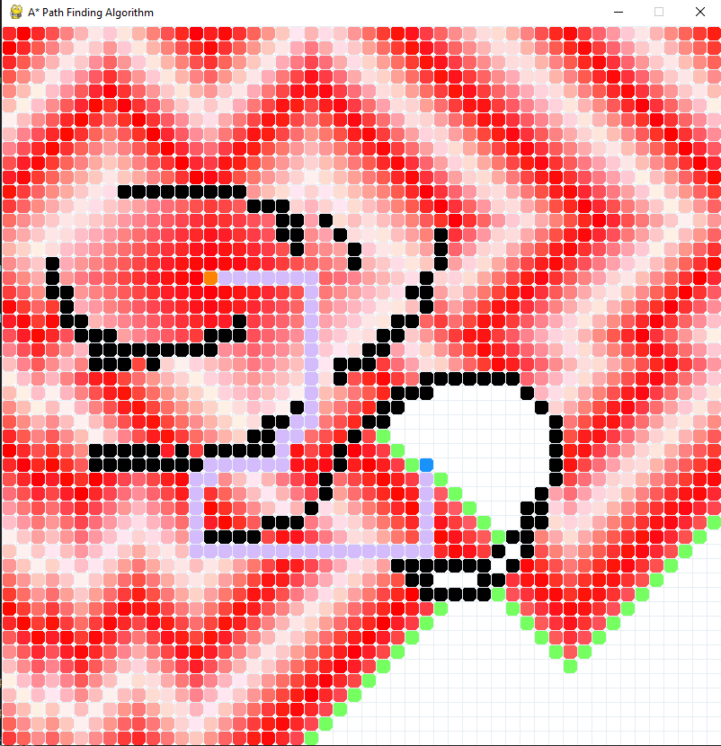
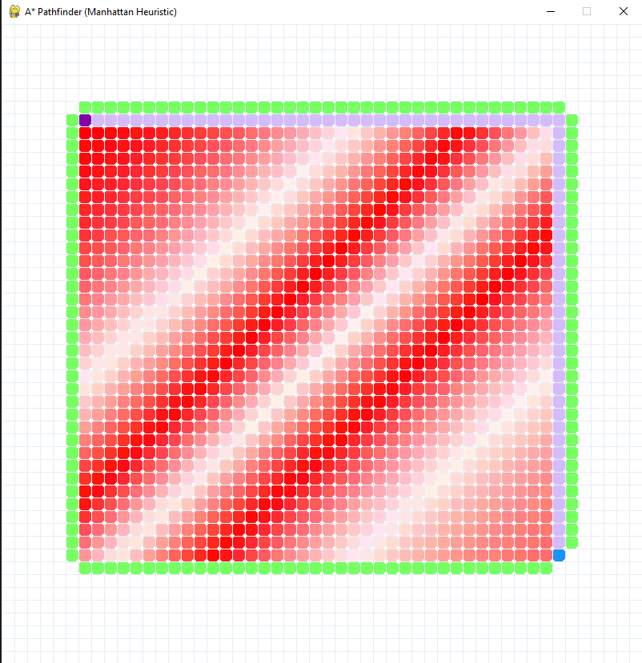
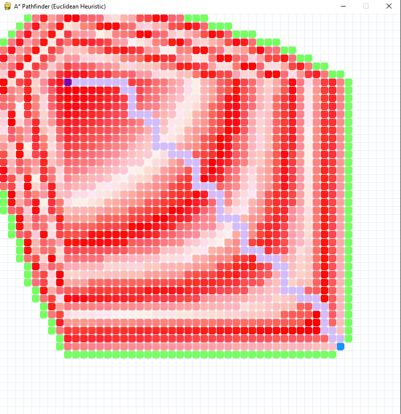
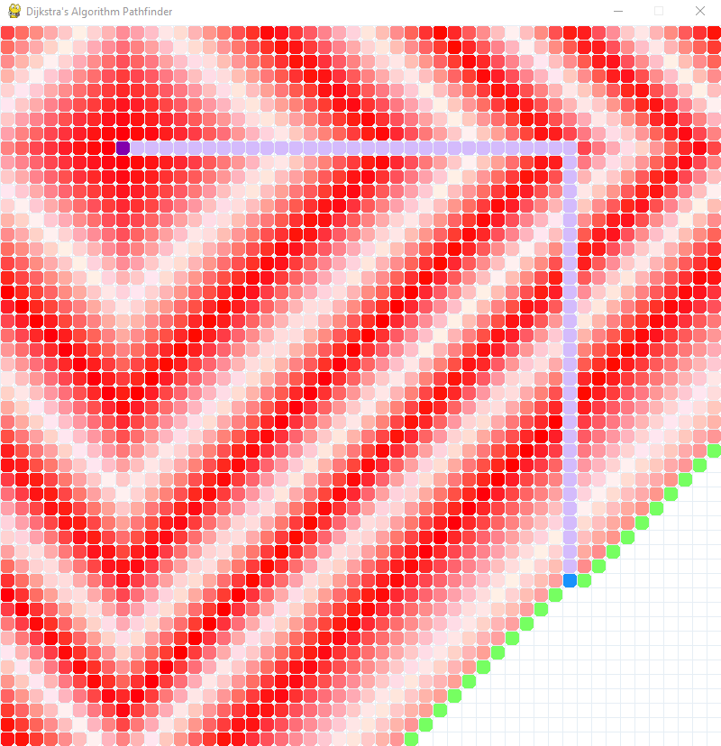
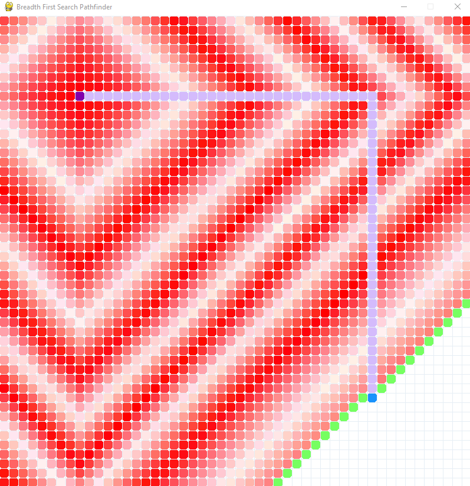
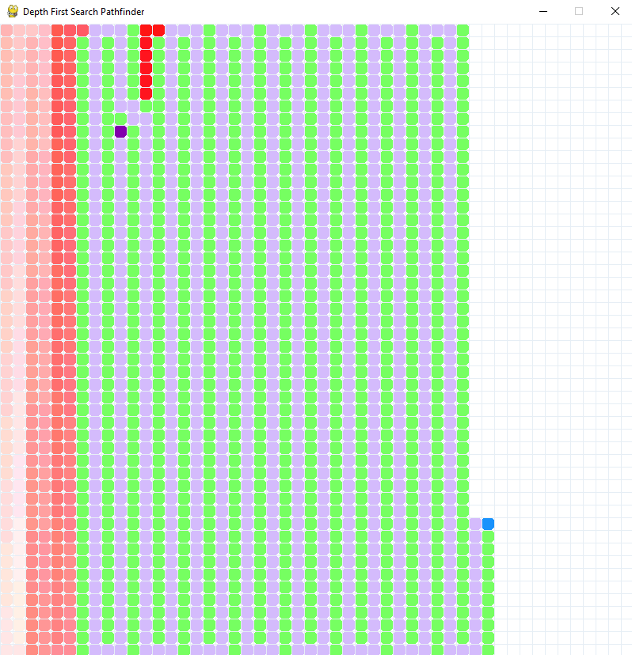

# Pathfinder Visualizer

## Supported Algorithms

- A* (Manhattan Heuristic)
- A* (Euclidean Heuristic)
- Depth First Search 
- Breadth First Search 
- Dijkstra's Algorithm 

## Usage

### Installation
- simply execute "application.exe" and give the app 1 - 2 mintues to load

### Color Code

- Purple: Start
- Blue: End
- Red gradient: Considered nodes 
- Green: Nodes that are currently in consideration

### Controls
- Left mouse click to place down start/end nodes and walls
- Right mouse click to delete nodes
- Spacebar to begin pathfinder
- Press "C" key to clear the screen once algorithms is done

## Usage Examples

### A* (Manhattan Heuristic)

### A* (Euclidean Heuristic)

### Dijkstra's Algorithm 

### Breadth First Search 

### Depth First Search 

